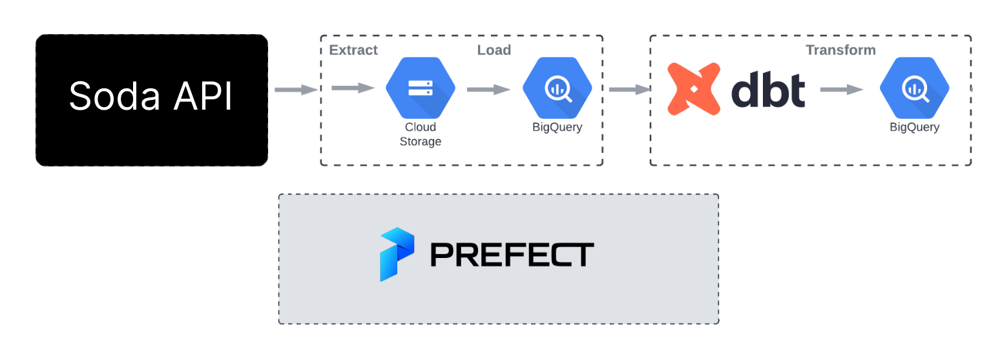

# Data Engineering Pipleine to perform Analytics on Covid Vaccinations Data Using Google Cloud

## Table of contents
- [Overview](#overview)
- [The Goal](#the-goal)
- [The dataset](#the-dataset)
- [Data modeling](#data-modeling)
- [Tools](#tools)
- [Insights](#Insights)
  
## Overview
This project builds an end-to-end orchestrated data pipeline to perform analytics on Covid Vaccine data. The data has been extracted with the help of SODA API for the states of Newyork and North Carolina. To reduce the scope of the project, only 2021 is considered. We are going to build a data pipeline which collects data from source, applies transformations and displays the preprocessed data.

## The Goal
As political beliefs can influence public perception and trust in government institutions and health authorities. This project aims to test these by analysing the actual numbers of vaccine dosage administrated for the two states. New York State has voted Democratic in national elections since 1988 and North Carolina on the other hand has been Republican. Other than that, Vaccine growth within the state was also analysed.

## The dataset

The dataset was accessed using Soda API and had orignally had 51 different attributes which were reduced to 15. 

| Coulmn Name  | Description |
| ------------- | ------------- |
| date          | Date |
| State  | State Code  |
| County          |  County Name |
| FIPS  | UNIQUE County Code |
| OneDoseComplete          | Number of people having one Dosage of vaccine |
| OneDoseCompleteP  |  Percentage of people having done one dosage of vaccine  |
| OneDoseComplete18P          |  Number of People (18 +) done with one dosage |
| OneDoseComplete65P  | Number of People (65 +) done with one dosage |
| CompleteDosagePercentage          | Percentage of People done with Complate Dosage ( Could be one or two depending on the vaccine) |
| BoosterDone  |  Number of people who have taken the vaccine  |
| CompleteDosageWBoosterPercentage          | Percentage of people who are done with both the basic vaccines and booster dosage |
| MetroStatus  | Status of the county to be Metro or Non-Metro  |
| Population2019          | census as of 2019 for the county |
| Population18P2019  | State Code  |
| date          | census as of 2019 for the county (18+) |
| Population65P2019  | census as of 2019 for the county (65+)  |

## Data modeling

 **Star Schema**  was used which comprises one fact and multiple dimension tables for our Data Warehouse. 
 Further, in dbt staging and Production dataset were setup

The lineage for the dataset looks as follows:

## Tools
- Cloud: `Google Cloud`
- Orchestration: `Prefect`
- Data lake: `Google Cloud Storage`
- Data transformation: `DBT`
- Data warehouse: `BigQuery`
- Data visualization: `Google Looker Studio`

## Insights

- 

