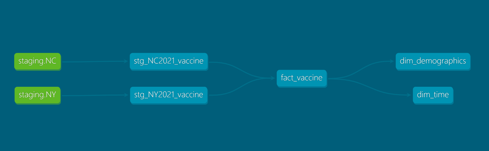

# Data Engineering Pipleine to perform Analytics on Covid Vaccinations Data Using Google Cloud

## Table of contents
- [Overview](#overview)
- [The Goal](#the-goal)
- [The dataset](#the-dataset)
- [Data modeling](#data-modeling)
- [Tools](#tools)
- [Scalability](#scalability)
- [Running the project](#running-the-project)

## Overview
This project builds an end-to-end orchestrated data pipeline to perform analytics on Covid Vaccine data. The data has been extracted with the help of SODA API for the states of Newyork and North Carolina. To reduce the scope of the project, only 2021 is considered. We are going to build a data pipeline which collects data from source, applies transformations and displays the preprocessed data into a dashboard.

## The Goal
As political beliefs can influence public perception and trust in government institutions and health authorities. This project aims to test these by analysing the actual numbers of vaccine dosage administrated for the two states. New York State has voted Democratic in national elections since 1988 and North Carolina on the other hand has been Republican. 
